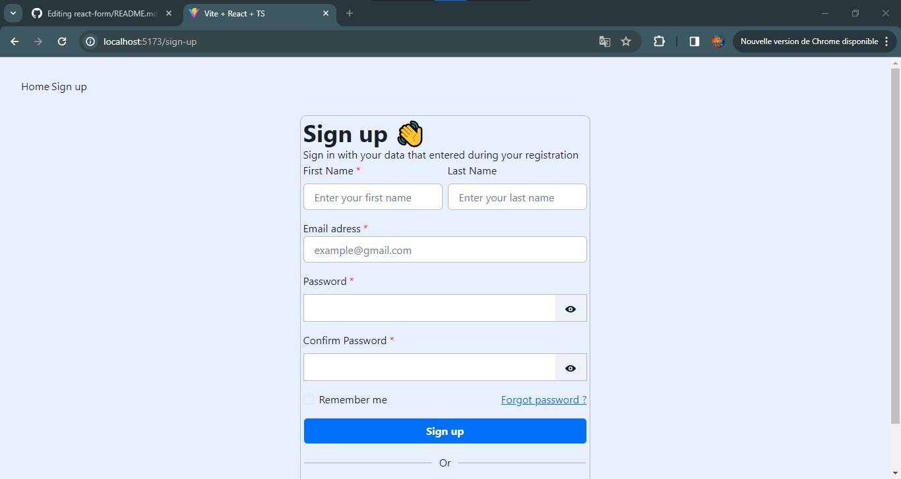

# Form by jo17-dev

 
 

 # Stack:
 
 [+] React
 
 [+] Vite

 [+] React-router-dom

# How to install the project:

[1] <code>git clone </code>

[2] <code>npm install </code>

[3] <code> npm run dev </code>
